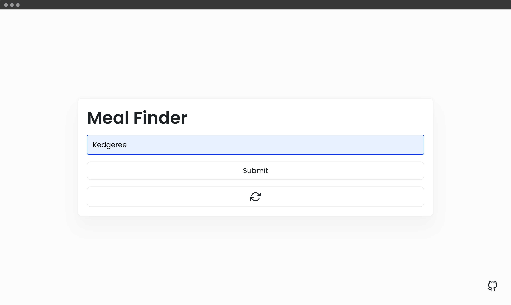
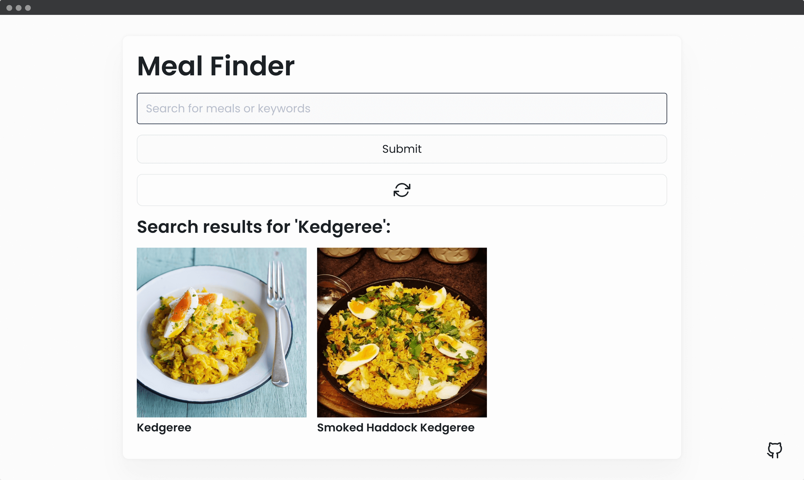
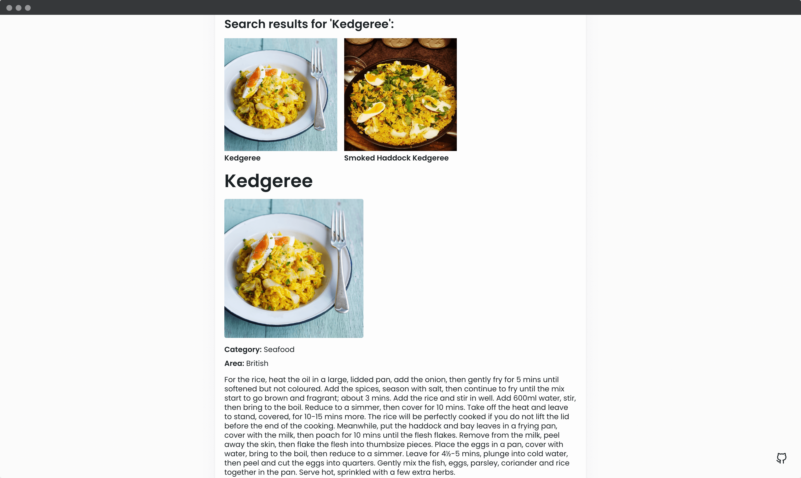

## 📦 Meal Finder App

Search and generate random meals from the [themealdb.com](www.themealdb.com) API.

- Display UI with form to search and button to generate
- Connect to API and get meals
- Display meals in DOM with image and hover effect
- Click on meal and see the details
- Click on generate button and fetch & display a random meal
---
#### 🌄 Screenshots:

-----

#### 💻 Stack:

- [JavaScript](https://learn.javascript.ru/)
- [Sass](https://sass-lang.com/)

#### 💻 API:

- [themealdb.com](www.themealdb.com)

-----
#### 🙌 Author: [@nagoev-alim](https://github.com/nagoev-alim)
